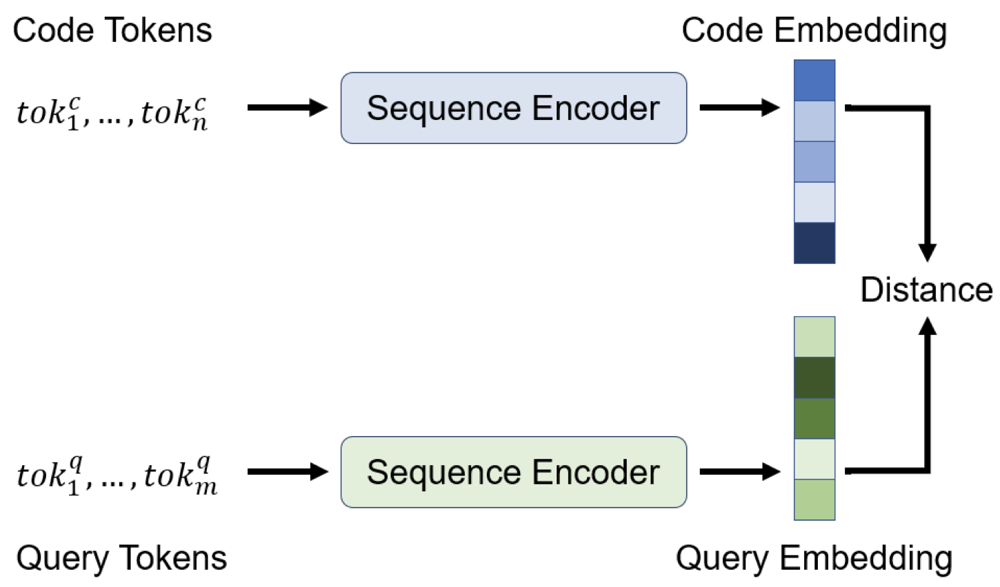

 [](https://opensource.org/licenses/MIT)  [](https://www.python.org/downloads/release/python-360/)
[](https://app.wandb.ai/github/CodeSearchNet/benchmark)

[paper]: https://arxiv.org/abs/1909.09436

# Semantic Code Search (CodeSearchNet Challenge)

This is a project for the CS-GY-6613 Artificial Intelligence course at NYU Tandon School of Engineering focusing on improving the Neural Bag of Words baseling model found in [CodeSearchNet](https://arxiv.org/abs/1909.09436).


## Background

Searching for code on GitHub is currently limited to lexical search in which the user must anticipate the exact keywords or syntax in the code that they are looking for. But what if a user is unable to provide an exact literal match, and can provide a concept in the code? **Semantic search** seeks to improve upon lexical search by understanding the overall meaning of a query. Such systems take into account the user's intent by considering factors such as contextual meaning, synonyms, natural language queries, and more in order to provide relevant search results. For example, searching for code that performs the insertion sort algorithm without using the words "insertion" or "sort." A semantic search should return reasonable results even though there are no keywords in common between the query and the text. This has the potential to expedite the process of on-boarding new software engineers onto projects and bolster the discoverability of code in general. 


## Project Overview

CodeSearchNet, is a collection of datasets and benchmarks that explore the problem of code retrieval using natural language. This research is a continuation of some ideas presented in this [blog post](https://githubengineering.com/towards-natural-language-semantic-code-search/) and is a joint collaboration between GitHub and the [Deep Program Understanding](https://www.microsoft.com/en-us/research/project/program/) group at [Microsoft Research - Cambridge](https://www.microsoft.com/en-us/research/lab/microsoft-research-cambridge/). The researchers aim to provide a platform for community research on semantic code search via the following: 

  1. Instructions for obtaining large corpora of relevant data
  2. Open source code for a range of baseline models, along with pre-trained weights
  3. Baseline evaluation metrics and utilities
  4. Mechanisms to track progress on a [shared community benchmark](https://app.wandb.ai/github/CodeSearchNet/benchmark) hosted by [Weights & Biases](https://www.wandb.com/)

The researchers hope that CodeSearchNet is a step towards engaging with the broader machine learning and NLP community regarding the relationship between source code and natural language. More context regarding the motivation for this problem is in this [technical report][https://arxiv.org/abs/1909.09436].

The initial CodeSearchNet Challenge implemented a range of baseline models including Neural Bag of Words (NBOW), Bidirectional RNN models, 1D Convolutional Neural Network, and Self-Attention. **For our project, we sought to improve NBOW by increasing the ```token_embedding_size``` hyperparameter from 128 to 512.**

## Data Schema & Format

Data is stored in [jsonlines](http://jsonlines.org/) format.  Each line in the uncompressed file represents one example (usually a function with an associated comment). A prettified example of one row is illustrated below.

- **repo:** the owner/repo
- **path:** the full path to the original file
- **func_name:** the function or method name
- **original_string:** the raw string before tokenization or parsing
- **language:** the programming language
- **code:** the part of the `original_string` that is code
- **code_tokens:** tokenized version of `code`
- **docstring:** the top-level comment or docstring, if it exists in the original string
- **docstring_tokens:** tokenized version of `docstring`
- **sha:** this field is not being used [TODO: add note on where this comes from?]
- **partition:** a flag indicating what partition this datum belongs to of {train, valid, test, etc.} This is not used by the model.  Instead we rely on directory structure to denote the partition of the data.
- **url:** the url for the code snippet including the line numbers

## Model Architecture

  The baseline models used ingest a parallel corpus of (`comments`, `code`) and learn to retrieve a code snippet given a natural language query.  Specifically, `comments` are top-level function and method comments (e.g. docstrings in Python), and `code` is an entire function or method. Throughout this repo, we refer to the terms docstring and query interchangeably.

  The query has a single encoder, whereas each programming language has its own encoder. The available encoders are Neural Bag of Words, RNN, 1D-CNN, Self-Attention (BERT), and a 1D-CNN+Self-Attention Hybrid.

  The diagram below illustrates the general architecture of our baseline models:

  


## Neural Bag of Words
Since this project focuses on a change to Neural Bag of Words, here we discuss it in more detail.

### a. Bag of Words Model

In general, Bag of Words is a method of extracting features from text which can be used in machine learning algorithms. It is called a "bag" of words because information about grammar and word order are discarded; it measures whether known words occur in a given text, and not where they occur. Each sentence or document is represented as a vector which contains a vocabulary of known words and a measure of the presence and the number of these known words in the text at hand. 

Consider the following example provided in [this](https://medium.com/greyatom/an-introduction-to-bag-of-words-in-nlp-ac967d43b428) article. Given the following corpus:
* *"It was the best of times"*
* *"It was the worst of times"*
* *"It was the age of wisdom"*
* *"It was the age of foolishness"*

To vectorize our documents, we count how many times each word appears:

| Document | it | was | the | best | worst | age | of | times | wisdom | foolishness |
| :---: | :---: | :---: | :---: | :---: | :---: | :---: | :---: | :---: | :---: | :---: |
*"It was the best of times"* | 1 | 1 | 1 | 1 | 0 | 0 | 1 | 1 | 0 | 0 | 
*"It was the worst of times"* | 1 | 1 | 1 | 0 | 1 | 0 | 1 | 1 | 0 | 0 |
*"It was the age of wisdom"* | 1 | 1 | 1 | 0 | 0 | 1 | 1 | 0 | 1 | 0 |
*"It was the age of foolishness"* | 1 | 1 | 1 | 0 | 0 | 1 | 1 | 0 | 0 | 1 |

The occurence of words in a text can be scored using a variety of other methods as well: for example, with a boolean value (0 if absent, 1 if present), by calculating the frequency that each word appears in a document out of all the words in the document, or with TF-IDF (Term Frequency - Inverse Document Frequency).


### b. Neural Bag of Words 
The Neural Bag of Words baseline model used by CodeSearchNet is a fully connected feed forward network that serves as the architecture for creating token embeddings of the code and query token sequences created by the Bag of Words model. The token embeddings are then combined into a sequence embedding using a pooling function. The resulting embedding representations of the code and query now exist in a joint vector space; the code embedding that is "closest" to a given query embedding is likely to be the best semantic match as determined by NBOW.

<p align="center">

</p>

Figure from the CodeSearchNet Challenge [paper](https://arxiv.org/abs/1909.09436).

The authors of the original CodeNetChallenge implemented the NBOW using a token embedding embedding size of 128, but here we increased that value to 512 with the hope that it might improve model performance. As mentioned in this [paper](https://papers.nips.cc/paper/7368-on-the-dimensionality-of-word-embedding.pdf) by Zi Yin and Yuanyuan Shen, the impact of dimensionality on word embedding has not yet been fully understood. However, in their study, Yin and Shen reveal that there exists a bias-variance trade-off in dimensionality selection for word embeddings: word embeddings with small dimensionality underfit while those with large dimensionality overfit. Thus, word embedding size should influence the performance of a given model. By increasing the token embedding size significantly, we hoped to gain insight into how larger word embedding sizes affect performance. 

## Setup

A fellow student was kind enough to create a [guide](https://github.com/aobject/NYU-AI-Project-03) for setting up the environment for CodeSearchNet using a Ubuntu virtual machine (with a Nvidia P4000 GPU) and Docker. The following commands were used to setup the Docker container, and train and evaluate the model. Benchmarks were submitted to [Weights and Biases](https://app.wandb.ai/github/codesearchnet/benchmark) for detailed metrics and submission to the CodeSearchNet Challenge leaderboard.

  ```bash
  # clone this repository
  git clone https://github.com/github/CodeSearchNet.git
  cd CodeSearchNet/
  # download data (~3.5GB) from S3; build and run the Docker container
  script/setup
  # this will drop you into the shell inside a Docker container
  script/console
  # optional: log in to W&B to see your training metrics,
  # track your experiments, and submit your models to the benchmark
  wandb login

  # verify your setup by training a tiny model
  python train.py --testrun
  # see other command line options, try a full training run with default values,
  # and explore other model variants by extending this baseline script
  python train.py --help
  python train.py

  # generate predictions for model evaluation
  python predict.py -r github/CodeSearchNet/0123456 # this is the org/project_name/run_id
  ```
## Results

The following chart provides Mean Reciprocal Rank (MRR) values on the test set of the CodeSearchNet Corpus using both the original NBOW model and the modified NBOW model. In general, MRR is used to rank possible responses to a sample of queries, ordered by probability of correctness. Here, given a documentation comment as a query, NBOW ranks the correct code snippet among 999 distractor snippets. An accurate model is capable of ranking the correct code snippet highly among the distractor snippets. If it is able to do this consistently it will have a high MRR. Thus, high test accuracy corresponds to a high MRR.

| Model | Go | Java | JS | PHP | Python | Ruby | Avg | 
| :---: | :---: | :---: | :---: | :---: | :---: | :---: | :---: | 
**Original** | 0.6409 | 0.5140 | 0.4607 | 0.4835 | 0.5809 | 0.4285 | 0.6167 |
**Modified** | 0.6687 | 0.5618 | 0.4887 | 0.5342 | 0.6333 | 0.4687 | 0.6561 | 

Since the modified NBOW model produced higher MRR values for every language, raising the ```token_embedding_size``` hyperparameter from 128 to 512 seems to have resulted in an improved model. Thus, in the future, it may be favorable to experiment with other values in order to find the optimal ```token_embedding_size``` value. Doing so may also provide insight into the bias-variance tradeoff in word embedding dimensionality as alluded to by Yin and Shen.

## Licenses

The licenses for source code used as data for this project are provided with the [data download](#downloading-data-from-s3) for each language in `_licenses.pkl` [files](resources/README.md#directory-structure).

This code and documentation for this project are released under the [MIT License](LICENSE).
